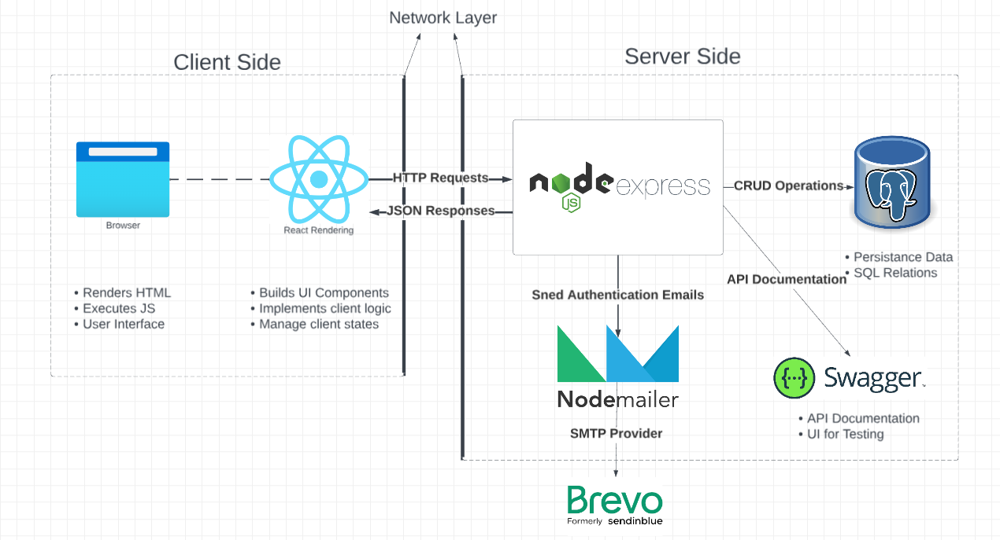
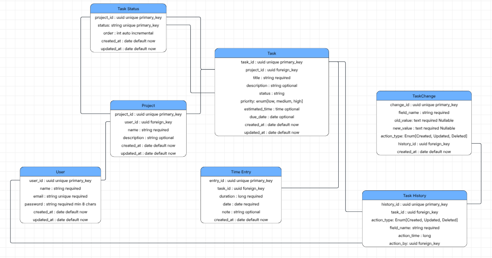

# Tackl

## Product overview

Tackl is a personal project and task-management application inspired by tools such as Trello and Linear. Users create personal projects, organize tasks on a three-column board, track estimates and time spent, and review the history of changes to each task.

The mandatory product is intentionally personal: multiple users may register, but each user can access only their own projects and data.

## Architecture

### Used technology

Frontend: React + TypeScript

Backend: Node.js + Express + TypeScript

Database: PostgreSQL with Sequelize ORM

API: RESTful JSON API

Email Messaging:

- Node mailer
- Brevo SMTP Provider

Documentation: Swagger API

Logging:

- Client History Log: shows the client actions for each task.
- Operational Log: use Winston logger for server logging.

Testing:

- Node Js Unit Testing
- React Js Unit Testing
- Swagger UI for Client Testing

Containerization: Docker with GHCR images

### High Level Design



### Database Entity Relationship Diagram



## Setup

### Clone the repository

```bash
git clone https://github.com/MostafaElKaranshawy/Tackl.git

cd Tackl
```

### Configure environment variables

Create a .env file in the project root similiar to the example file: `.env.example`

### Steps

1. Update the values according to your required configuration.

2. Create the PostgreSQL database with the same credintials in the `.env` file.

3. Run the project

    - Backend

      ```bash
      cd ./Backend
      npm install
      npm run dev
      ```

    - Frontend

      ```bash
      cd ./Frontend
      npm install
      npm run dev
      ```
