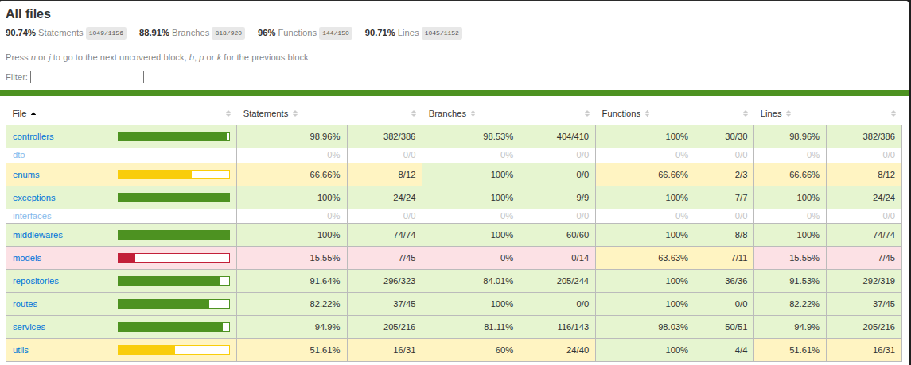
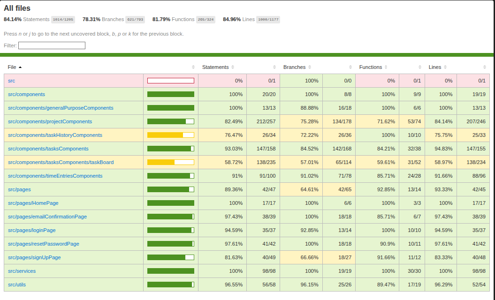

# Tackl

## Product Overview

Tackl is a personal project and task-management application inspired by tools such as Trello and Linear.

Users can:

- Create and manage personal projects.
- Organize tasks individually in each project.
  - Track task priorities, due dates, and time spent.
  - Track task working time and log the finished time slots.
  - Search and filter tasks based on different critereas
    - Search by keywords in tasks title or description.
    - Filter tasks by status, priority, overdued tasks.
  - Drag tasks between different column to change the task working status.
- Customize each project status depending on the required working flow of the project
  - Adding new project statuses that appear as new columns to add tasks in.
  - Reordering of the statuses flow of the project by drag the columns to required position.
- Track Tackl workflow, modifications for each task to allow user actions' history logging.

The application supports multiple registered users. However, the product is intentionally personal: each user can access only their own projects, tasks, time entries, and related data.

---

## Architecture

### Used Technologies

**Frontend:** React + TypeScript + Vite

**Backend:** Node.js + Express + TypeScript

**Database:** PostgreSQL + Sequelize ORM

**API:** RESTful JSON API

**Email Messaging:**

- Nodemailer
- Brevo SMTP Provider

**API Documentation:** Swagger / Swagger UI

**Traceability:**

- **Client-level** Add task level history Logs to track user actions and changes made to each task.
- **Operational Log:** Winston logger for backend/server logging to trace system state and behaviour throughout the working time, showing the handled requests, catched errors with the trace of each error, warnings, system initialization and shutdown logs.

**Testing:**

- Node.js Unit Testing using Vitest
- React.js Unit Testing using Vitest
- Swagger UI for API/client testing.

#### Testing Coverage

##### Backend Coverage



##### Frontend Coverage



---

**Containerization:**

- Docker

### High Level Design


### Database Entity Relationship Diagram


---

## System Prerequisites

The following software is required to run the project locally:

- Git
- Node.js 22.x or later
- npm
- PostgreSQL 18.x

### Verify Node.js and npm

```bash
node --version
npm --version
```

### Verify PostgreSQL

```bash
psql --version
```

Make sure PostgreSQL is running before starting the backend.

On Linux:

```bash
sudo systemctl status postgresql
```

If PostgreSQL is not running:

```bash
sudo systemctl start postgresql
```

---

## Setup

### Clone the Repository

```bash
git clone https://github.com/MostafaElKaranshawy/Tackl.git

cd Tackl
```

### Configure Environment Variables

Create a `.env` file in the `Backend` directory similar to the example file:

```text
/Backend/.env.example
```

Create a `.env` file in the `Frontend` directory similar to the example file:

```text
/Frontend/.env.example
```

Update the values according to your required configuration.

> Do not commit `.env` files or any secrets to the repository.

---

### PostgreSQL Setup

Tackl uses PostgreSQL as its database and Sequelize as its ORM.

Create the PostgreSQL database using the same database credentials configured in:

```text
Backend/.env
```

Connect to PostgreSQL:

```bash
sudo -u postgres psql
```

Create the database:

```sql
CREATE DATABASE tackl;
```

If you are using a dedicated PostgreSQL user, create the user and grant access:

```sql
CREATE USER tackl_user WITH PASSWORD 'your_password';

GRANT ALL PRIVILEGES ON DATABASE tackl TO tackl_user;
```

Exit PostgreSQL:

```sql
\q
```

The PostgreSQL configuration should match the values used by the backend.

Example:

```env
DB_HOST=localhost
DB_PORT=5432
DB_NAME=tackl
DB_USER=tackl_user
DB_PASSWORD=your_password
```

---

## Run the Project

The backend and frontend are separate applications and should be started independently.

### Backend

Open a terminal and run:

```bash
cd ./Backend
npm install
npx sequelize-cli db:migrate # for database migrations
npm run dev
```

The backend will normally run on:

```text
http://localhost:5000
```

### Backend Commands

| Command | Description |
| --- | --- |
| `npm run dev` | Start the development server |
| `npm run build` | Compile the TypeScript backend |
| `npm start` | Run the compiled production backend |

---

### Frontend

Open another terminal and run:

```bash
cd ./Frontend
npm install
npm run dev
```

The frontend will normally run on:

```text
http://localhost:5173
```

### Frontend Commands

| Command | Description |
| --- | --- |
| `npm run dev` | Start the Vite development server |
| `npm run build` | Type-check and build the frontend |
| `npm run lint` | Run ESLint |
| `npm run preview` | Preview the production build |

---

## Environment Configuration

The project uses separate environment files for the backend and frontend:

```text
Tackl/
├── Backend/
│   ├── .env
│   └── .env.example
│
└── Frontend/
    ├── .env
    └── .env.example
```

The frontend API URL should point to the running backend.

Example:

```env
VITE_API_URL=http://localhost:5000
```

> don't forget that the localhost will change if using docker/deployment.

The backend environment variables should contain the PostgreSQL database credentials, JWT configuration, frontend URL, and SMTP/Brevo configuration required by the application.

---

## Docker

The project supports containerized deployment using Docker.

Verify Docker installation:

```bash
docker --version
```

Change the .env url variables in the `./Backend/.env`

```bash
DB_HOST=tackl-db
```

### Build docker images and running the contrainers

```bash
docker compose up
```

Stop and remove the running containers

```bash
docker compose down
```

Rebuild certain image

- Directly from dockerfile

```bash
cd ./Backend
docker build .
```

>or

```bash
cd ./Frontend
docker build .
```

- From docker compose file

```bash
docker compose build --no-cache image-name
```

> The `--no-cache` argument builds the image from scratch even if it was built before (reinstalling the dependencies again).

### Access running application

```bash
http://localhost:5173/ # or whatever port you use.
```

### Access system logs

- From docker terminal

```bash
docker ps # to get the running containers
docker logs container-name-or-id
```

- From the log files in the server

  - Run the server as interactive terminal
  - Access the files in the server directory

```bash
docker exec -it tackl-server sh
cd logs/
ls
cat error.log
exit
```

---

## Testing

The project contains unit tests for both the backend and frontend.

### Backend Tests

Navigate to the backend directory:

```bash
cd ./Backend
npm run test:coverage
```

### Frontend Tests

Navigate to the frontend directory:

```bash
cd ./Frontend
npm run test:coverage
```

### API Testing

Swagger UI is provided for testing and exploring the REST API.

Once the backend is running, open the Swagger UI endpoint configured by the backend.

```bash
http://localhost:4000/api-docs
```

> Change the port to the one you use for tackl-server container.
---

## API Documentation

The backend provides API documentation using Swagger.

Swagger describes the available REST API endpoints, request parameters, request bodies, and responses.

Swagger UI can also be used to manually test the API endpoints.

```bash
http://localhost:4000/api-docs
```

> Change the port to the one you use for tackl-server container.
---
---

## Logging / Traceability

Tackl provides two types of logging.

### Client History Log

The client history log records task-related user actions and changes.

Examples include:

- Task creation
- Task updates
- Task deletion
- Changes to task fields
- Changes to task status or position

### Operational Log

The backend uses Winston for server-side operational logging.

Operational logs are intended for monitoring and debugging backend activity, errors, and application behavior.

---

## Technology Stack

### Frontend Stack

- React
- TypeScript
- Vite
- React Router
- Tailwind CSS
- Axios
- React Icons
- React Toastify

### Backend Stack

- Node.js
- Express.js
- TypeScript
- Sequelize
- PostgreSQL
- JWT
- bcrypt
- Nodemailer
- Brevo SMTP
- Swagger
- Winston

### Testing Stack

- Node.js Unit Testing with vitest
- React Unit Testing with vitest
- Swagger UI

### DevOps

- Docker
